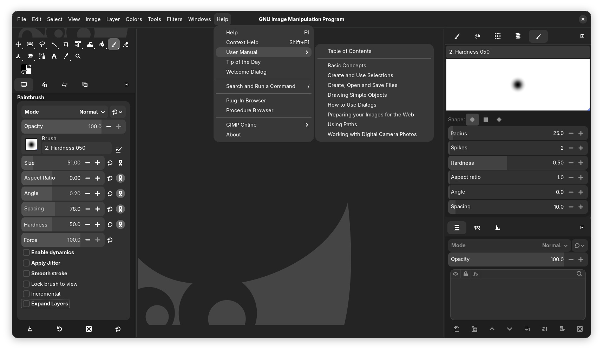

# Adwaita Theme for GIMP 3: adw-gimp3

_A complementary theme to adw-gtk3 for perfect GIMP styling_

### Installation

1. Install the [adw-gtk3](https://github.com/lassekongo83/adw-gtk3) theme first
2. Download the adw-gimp3 repository
3. Either:
   - Run `install.sh`, or
   - Manually copy the `adw-gimp3` folder to `~/.config/GIMP/3.0/themes/`
4. Launch GIMP and navigate to:
   `Edit → Preferences → Theme` → Select "adw-gimp3"
5. *(Optional)* For better integration:
   `Edit → Preferences → Image Windows` → Enable "Merge menu and title bar"
6. Done!

### Notes
- Currently only dark theme is supported (Light theme will be added)
- Windows and macOS support is planned (Will be fixed in future updates)

### Screenshot

